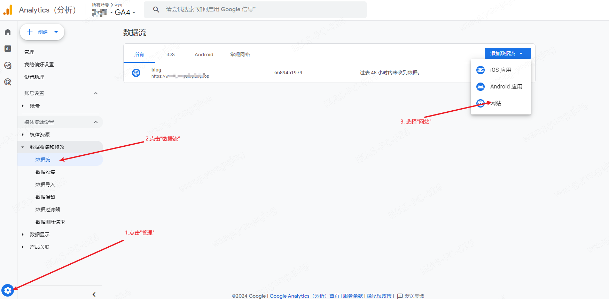
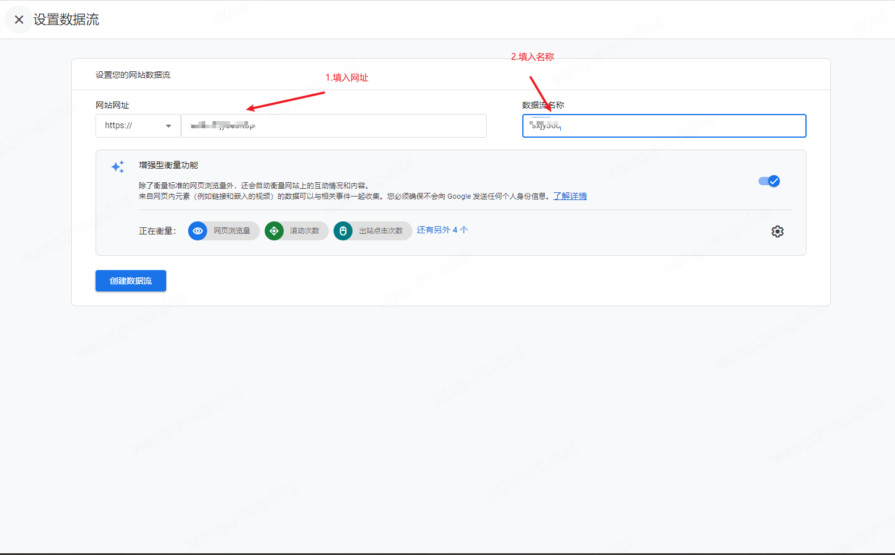
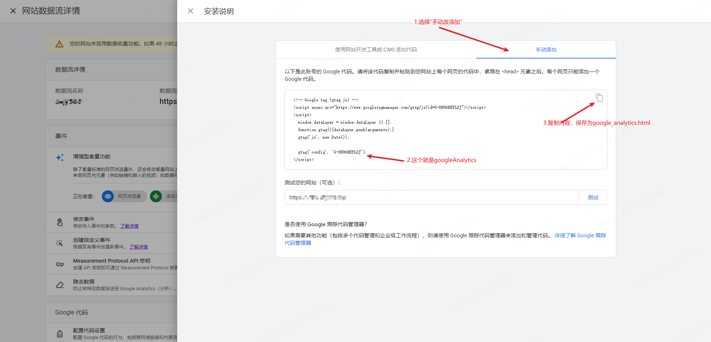

+++
title = "hugo添加google analytics"
date = 2024-01-31T15:10:00+08:00
categories = ["doc"]
tags = ["hugo", "seo"]
draft = false
summary = "使用新版本的google analytics为网站添加seo分析. 旧版本在2024年7月截止"
+++

# 描述

使用新版本的google analytics为网站添加seo分析. 旧版本在2024年7月截止 

# 环境

* hugo版本: v0.122.0-b9a03bd59d5f71a529acb3e33f995e0ef332b3aa+extended linux/amd64 BuildDate=2024-01-26T15:54:24Z VendorInfo=gohugoio
* hugo主题: [LoveIt](https://github.com/miaoyin/LoveIt)
* google分析: [https://analytics.google.com/analytics/web](https://analytics.google.com/analytics/web)
* google搜索控制台: [https://search.google.com/search-console](https://search.google.com/search-console)

# 获取googleAnalitics







# 新建google_analytics.html 

* 新建目录

```shell
#layouts与themes目录在同一级
mkdir -p layouts/_internal
touch layouts/_internal/google_analytics.html
```

* google_analytics.html内容，替换为上面得到的code

```html
<!-- Google tag (gtag.js) -->
<script async src="https://www.googletagmanager.com/gtag/js?id=G-衡量ID"></script>
<script>
  window.dataLayer = window.dataLayer || [];
  function gtag(){dataLayer.push(arguments);}
  gtag('js', new Date());

  gtag('config', 'G-衡量ID');
</script>
```


# 修改config.toml

```toml
googleAnalytics = "G-衡量ID"
```


# 修改主题head

    以LoveIt主题为例, 在文件头部添加themes/LoveIt/layouts/partials/head/seo.html

```html
{{- with .Site.GoogleAnalytics -}}
    {{ template "_internal/google_analytics.html" }}
{{- end -}}
```

# 注意

    hugo经常在更新, theme经常更新不及时, 导致config.toml中的配置无效, 需要自己手动修改theme

* [佛說大乘無量壽莊嚴清淨平等覺經pdf](http://www.sxjy360.top/page-download/)
* [净土大经科注2014-doc](http://www.sxjy360.top/page-download/)
* [此生必看的科学实验-水知道答案](http://www.sxjy360.top/page-download/)
* [印光大师十念法（胡小林主讲第1集）](http://www.sxjy360.top/page-download/)